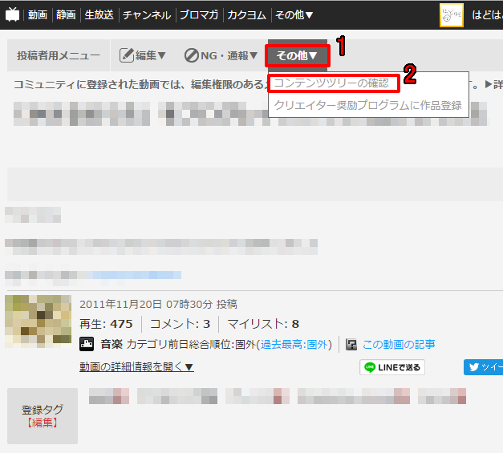

このページでは、ニコニコ動画での「コンテンツツリー登録」の手順を解説します。

コンテンツツリーとは動画やゲーム、素材などのコンテンツを評価するための機能です。

ですので実況動画や二次創作動画などをツリー登録していただくことで、我々は励みになります。

コンテンツツリー登録して頂けるなら、正しく登録して頂きたく思います。

最近、コンテンツツリー登録の方法を勘違いしている人が多いので、ここで解説していきます。
 
### ０．あなたの投稿したプレイ動画のページを開きます。
※二次創作動画についても同様です。

### １．ページ上部にある「投稿者用メニュー」をクリック。
### ２．項目から「コンテンツツリーの確認」をクリック。



## ここでページが変わります
### ３．「コンテンツツリーの登録」をクリック。
※「親作品を登録する コンテンツツリーの登録へ」というボタンでもOKです。


## ここでページが変わります
### ４．黒い範囲の左上にある「○○から検索」をクリック。
※デフォルトでは「niconicoマイリストから検索」となっています。
### ５．項目から「IDから指定」をクリック。


### ６．ゲームの説明書やDL先のページに書かれている、コンテンツツリー登録対象の作品IDをクリップボードにコピーします。


```
記載されているのが動画のURLの場合は「sm****」となっている部分、
RPGアツマールのURLの場合は「gm****」となっている部分がIDです。
```

### ７．「作品ID」に先程コピーしたIDを貼りつけます。
### ８．隣の「＋」ボタンを押します。
### ９．入力が正しければ、下に項目が出現します。


### 10．出現した項目を「親作品」へドラッグ＆ドロップ。


### 11．「この内容でコンテンツツリーを作成する」をクリック。


## ここでページが変わります
### 12．画像のように登録されていれば完了です。


## 注意！
### 親作品と子作品を間違えないで！
親子作品の意味は「親作品から生まれた作品が子作品」です。

紹介動画や元の動画を子作品にして、あなたの動画を親作品にしてしまうと、あなたが「このゲーム（元の動画）は私が作った物だ」と主張するのと同じです。

十二分に注意してください。

### 親作品は複数登録できます！
親作品に紹介動画を登録して、自分の実況動画のPart1や前回の動画を親作品に登録することも可能です。

また、ニコニ・コモンズで入手した素材を動画に使っているなら、それらも親作品に登録しておくことをお勧めします。

### クリエイター奨励プログラムについて
正しくコンテンツツリー登録して頂いた場合に限り、Had2Appsのゲームの多くを許可していますので、

[詳しくはこちら](../)をご覧ください。
　
## お願い
コンテンツツリー登録によって得られたスコア等はサークルの活動資金として役立てられます。

今後も面白いゲームを作り続けていくためにも、どうかご協力いただけますと嬉しいです。
